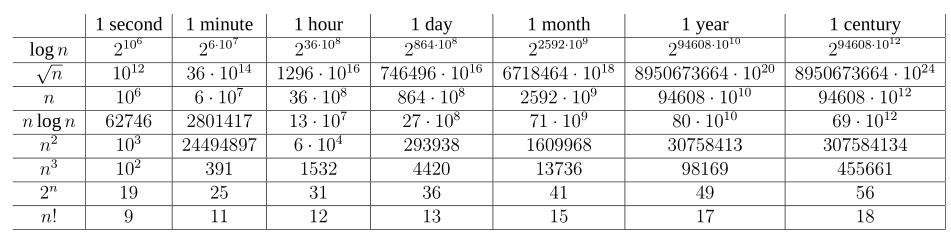

## 练习

### 给出现实生活中需要排序的一个例子和计算凸壳的例子

答：例如学生成绩的排序，凸壳则比较复杂了，比如在大海中打捞飞机的话需要根据一些重要的点计算搜 寻范围，需要确定最小搜索面积的话，需要求出凸壳的顶点集然后才能求出面积。

### 除速度外，在真实环境中还可能使用哪些其他有关效率的量度

答：功率

### 选择一种你以前已知的数据结构，并讨论其优势和局限

答：线性表，优点：存储密度高，可以随机存取结点。
缺点：①长度为定值，中途无法扩充。②插入删除需要移动结点，效率低。

### 前面给出的最短路径与旅行商问题有哪些相似之处？有哪些不同？

答：相似之处都是要求求出一个最短路径，但最短路径是定点求路线，而旅行商是点和路线一起求，在复杂度上比最短路径要高。

### 提供一个现实生活的问题，其中只有最佳解才行

### 1.2-1 给出在应用层需要算法内容的应用的一个例子，并讨论涉及的算法的功能

### 1.2-2 假设我们正比较插入排序与归并排序在相同机器上的实现。对规模为n的输入，插入排序运行8n2,而归并排序需要运行64nlgn步。对哪些n值，插入排序优于归并排序。

64*log2n -8*n2 = 0  
8log2n - n =0  
n =8lgn/lg2
在整数范围中当43≥n≥2时，符合条件

### 1.2-3 n的最小值为何值时，运行时间为100n2的一个算法在相同机器上快于运行时间为2n的另一个算法。

最小值为15

##思考题

### 1-1(运行时间的比较)假设求解问题的算法需要f(n)微秒，对下表中的每个函数f(n)和时间t，确定可以在时间t内求解的问题的最大规模n

越往下的算法效率越低