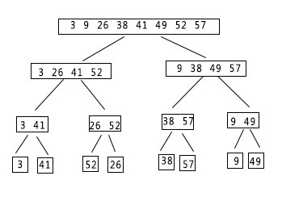
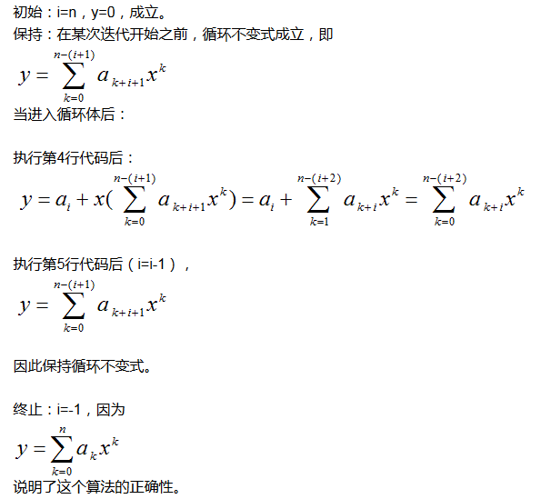

##练习
### 以图2-2为模型，说明INSERTION-SORT在数组A=<31,41,59,26,41,58>上的执行过程

A=<31,41,59,26,41,58>,检查<31,**41**,59,26,41,58>,符合要求继续。 
检查<31,41,**59** ,26,41,59>继续<31,41,59,**26**,41,58> 
交换/检查<31,41,**26** ,59,41,58>交换/检查<31,**26**,41,59,41,58> 
交换/检查<**26** ,31,41,59,41,58>继续 
检查(26,31,31,41,59,**41**,58>交换/检查<26,31,41,**41** ,59,58>继续 
检查<26,31,41,41,59,**58**>交换/检查<26,31,41,41,**58**,59>结束

### 重写过程INSERTION-SORT，使之按升序(而不是降序)排序

	def insertion_sort(A):
		for i in range(1,len(A)):
			key = A[i]
			j = i - 1
			while j>-1 and A[j]>key:
				A[j+1]=A[j]
				j = j-1
			A[j+1] = key
		print(A)

	def reverse_insertion_sort(A):
      for i in range(1,len(A)):
        key=A[i]
        j=i-1
        while j>-1 and A[j]<key:
            A[j+1] = A[j]
            j = j -1
            A[j+1] = key
            print(A)
        print(A)

### 考虑以下查找问题： 输入:n个数的一个序列A=(a1,a2,...,an)和一个值v。 输出:下标i使得v=A[i]或者v不在A中出现。 写出线性查找的伪代码，它扫描整个数列来查找v。使用一个循环不变式来证明你的算法是正确的。确保你的循环不变式满足三条必要的性质。
	def linear_search(A,v):
      for i in range(len(A)):
        if A[i] == v:
            return i

### 2.2-1 用θ记号表示函数n3/1000-100n2-100n+3

答:θ=n3

### 2.2-2 考虑排序存储在数组A中的n个数:首先找出A中的最小元素并将其A[1]中的元素进行交换。接着，找出A中的最小元素并将其余A[2]中的元素进行交换。对A中前n-1个元素按方式继续。该算法成为选择算法，写出其伪代码。该算法维持的循环不变式是什么?为什么它只需要对前n-1个元素，而不是对所有的元素进行?用θ记号给出选择排序的最好情况与最坏情况运行时间。

伪代码:

	Selection-Sort(A)
	n = A.length
	for j=1 to n-1
		smallest = j
		for i = j+1 to n
			if A[i]<A[smallest]
				smallest = i
		exchange A[j] with A[smallest]
	

Python:

	#usr/bin/python
	def sort_desc(A):
    for i in range(len(A)):
        k = i
        for j in range(i+1,len(A)):
            if(A[j]<A[k]):
                k = j
        A[k],A[i] = A[i],A[k]
    return A
该算法维持的循环不变式A[1,...,i],而最后一个元素自然被排序了,A[A.length]必然是最大的数字。θ(best)=n,θ(worst)=n2

### 2.2-3 再次考虑线性查找问题。假定要查找的元素等可能为数组中的任意元素，平局查找检查输入序列的多少元素？最坏情况又如何呢？用θ记号给出线性查找的平均情况和最坏情况运行时间。证明你的答案

θ(avg) = n/2
θ(worst) = n

### 我们可以如何修改几乎任意算法来使之具有良好的最好情况运行时间？

修改算法，以便它在测试一些特殊情况的条件，并输出一些预先计算好的应答。

## 2.3.1分治法

递归树具有lgn+1层，每层的代价均为cn，所以总代价为cn(lgn+1)=cnlgn+cn。忽略低阶项和常量c便给出了期望的结果θ(nlgn)。

### 2.3-1 使用图2-4作为模型，说明归并排序在数组A=<3,41,52,26,38,57,9,49>上的操作

### 2.3-2 重写过程MERGE，使它不使用哨兵，而是一旦数组L或R的所有元素均被复制回A就立刻停止，然后把另一个数组的剩余部分复制回A。

MERGE(A,p,q,r) 
1 n1 = q-r+1 
2 n2 = r-q 
3 let L[1..n1] and R[1..n2+1] be new arrays 
4 for i = 1 to n1   
5 　L[i] = A[p+i-1]  
6 for j = 1 to n2   
7 　R[j] = A[q+j] 
8 i = 1
9 j = 1
10 while L.length>0 and R.length>0 
11 　for k = p to r 
12　　	if L[i]<=R[j] 
13　　　　　A[k]=L[i] 
14　　　　　i = i+1 
15　　　else A[k] = R[j]
16　　　　　j = j+1 
17 A[k] += L[i] to L[n1] 
18 A[k] += L[j] to L[n2]

### 2.3-3 使用数学归纳法证明:当n刚好是2的幂时，以下递归式的解是T(n)=nlgn。 T(n)=2  若n=2 T(n)=2T(n/2)+n 若n=2k,k>1

当n=2 nlgn=2lg2 
经过归纳，T(n/2) = (n/2)lg(n/2),所以 
T(n) = 2T(n/2)+n 
　　= 2(n/2)lg(n/2)+n 
　　= n(lgn-1)+n 
　　= nlgn - n + n = nlgn

### 2.3-4 我们可以把插入排序表示为如下的一个递归过程。为了排序A[1..n]，我们递归地排序A[1..n-1]，然后吧A[n]插入已排序的数组A[1..n-1]。为插入排序的这个递归版本的最坏情况运行写一个递归式。

	Recursive_InsertionSort(A,q)
		if q>0
			Recursive_InsertionSort(A,q)
			Insert(A,q)  //将A[q]插入合适的位置
	
### 2.3-5 回顾查找问题，注意到，如果序列A已排好序，就可以将该序列的中点与v进行比较。根据比较的结果，原序列中有一半就可以不用再进一步的考虑。二分查找算法重复这个过程，每次都将序列剩余部分的规模减半。为二分查找写出迭代或递归的伪代码。证明:二分查找的最坏情况运行时间为lgn。

采用python实现
	#递归版本
	def binary_search(a, x, lo=0, hi=None):
   		if hi is None:
        	hi = len(a)
    	while lo < hi:
        	mid = (lo+hi)//2
        	midval = a[mid]
        	if midval < x:
            	lo = mid+1
        	elif midval > x:
            	hi = mid
        	else:
            	return mid
    	return -1
	#非递归版本
	def binary_search2(a,x):
    i = 1
    j = len(a)
    while(i<=j):
        m = (i+j)//2
        if(a[m] == x):
            return m
        elif (a[m]>x):
            j = m -1
        else:
            i = m + 1
    return -1

伪代码
	//非递归版本
	ITERATIVE-BINARY-SEARCH(A,v,low,high)
	while low<=high
		do mid<-[(low+high)/2]
			if v = A[mid]
				then return mid
			else if v > A[mid]
				then low<-mid+1
				else high<-mid-1
	return NIL
	
	//递归版本
	RECURSIVE-BINARY-SEARCH(A,v,low,high)
	if low > high
		then return NIL
	mid <-[(low+high)/2]
	if v = A[mid]
		then return mid
	if v > A[mid]
		then return RECURSIVE-BINARY-SEARCH(A,v,mid+1,high)
		then return RECURSIVE-BINARY-SEARCH(A,v,low,mid-1)

当二分查找返回false时，则每次长度减少一半，减少到1需要lgn次。 

##思考题

### 2-1 在归并排序中对小数组采用插入排序 

a.对于k个元素插入排序的最坏时间为θ(k2),所以排序n/k个子数列的总最坏时间为θ(k2n/k)=θ(nk)

b.如果用归并排序原始的合并方法，即每次从n/k个子数列中找到最小的然后复制到返回的数组中，所需要的最坏时间为θ(n(n/k))=θ(n22/k) 
如果想在θ(nlog(n/k))的时间内完成合并，我们可以对n/k个子数列进行合并，直到最后合成一个表，所需要的时间即为θ(nlog(n/k))

c.当k=θ(logn)时，有θ(nk+nlog(n/k))=θ(nk+nlogn-nlogk)=θ(2nlogn-nloglogn)=θ(nlogn)，与归并排序的渐进运行时间相同

d.实际中，k是最大的数列长度，使得插入排序比归并排序快。

### 冒泡排序

冒泡排序是一种流行但低效的排序算法，它的作用是反复交换相邻的未按次排序的元素
	
	BUBBLESORT(A)
	1 for i = 1 to A.length -1
	2	for j = A.lenght downto i+1
	3 		ifA[j]<A[j-1]
	4 			exchange A[j] with A[j-1]

a.假设A'表示BUBBLESORT(A)的输出。为了证明BUBBLESORT正确,我们必须证明它将终止并且有:

	A'[1]<=A'[2]<=...<A'[n]

其中n=A.length。为了证明BUBBLESORT确实完成了排序，我们还需要证明什么？

答:还需要证明A‘是A的一个数列

b.为第2~4行的for循环精确地说明一个循环不变式，并证明该循环不变式成立。你的证明应该使用本章中给出的循环不变式证明的结构。

b.**Loop invariant** 
对于每次开始迭代时，A[j]=min{A[k]:j<=k<=n},并且，显然A[j..n]是初始时A[j..n]的一个序列 
**Initialization**: 
初始时,j=n,A[j..n]仅有一个元素A[n]，循环不变式显然成立 
**Maintenance**: 
根据循环不变式，A[j]是A[j..n]的最小元素;如果A[j-1]>A[j]，那么通过交换A[j]和A[j-1],使得A[j-1]是A[j-1..n]的最小值;有与在迭代开始之前，A[j..n]是初始时A[j..n]的一个排列，而在迭代中仅仅是交换了A[j-1]和A[j]，所以A[j-1..n]必然也是初始时A[j-1..n]的一个排列；进入下一次迭代之前，j的值减少为j-1 
当j=i时，循环结束；A[i] = min{A[k]:i<=k<=n},并且A[i..n]是初始时A[i..n]的一个排列 

c.使用(b)部分证明的循环不变式的终止条件，为第1~4行的for循环说明给出一个循环不变式，该不变式将使你能证明不变式(2.3)。你的证明应该使用本章中给出的循环不变式证明的结构。

c.**Loop invariant**: 
对于每次开始迭代时，A[1..i-1]包含初始时A[1..n]的最小的i-1个元素，并且A[1]<=A[2]<=..<=A[i-1]，而A[i..n]包含初始时，A中剩余的n-i+1元素 
**Initialization**: 
初始时，i=1,A[1..i-1]是空集，循环不变式显然成立 
**Maintenance**: 
根据循环不变式，A[1..i-1]包含初始时A[1..n]的最小i-1个元素，并且A[1]<=A[2]<=..A[i-1];而执行2~4行使得A[i]是A[i..n]中最小的一个，所以现在A[1..i]是初始时A[1..i]中元素的非递减排列;A[i+1..n]包含初始A中剩余的n-i个元素 
**Termination**: 
当i=n时，循环结束;A[1..i-1]即A[1..n-1]是初始时A[1..n-1]的非递减排列，且包含A中最小的n-1元素;显然,A[n]是A中最大的元素，所以A[1..n]是初始A排序后的排列。

d.冒泡排序的最坏情况运行时间是多少?与插入排序运行相比，其性能如何?

答:冒泡排序的最坏运行时间为θ(n2)，和插入排序最坏运行时间相同，但插入排序的效果要好于冒泡排序。原因:插入排序的内部迭代平均需要(i/2)次，而冒泡排序需要(i2/2)

### 2-3 Horner规则的正确性

a.θ(n)

b.a0项需要时间为0，因为直接输出即可 
a1x项需要时间为1，因为需要进行一次乘法 
a2x2项需要进行时间为2,因为两次乘法。 
... 
anxn项需要时间为n，因为n次乘法。 
所以共需要0+1+2+..+n=n(n+1)/2=θ(n2)

	Naive-Polynomial-Evalution(P(x),x)
	1 t= 0
	2 for i = 0 to n
	3 	t = 1
	4 	for j =1 to i
	5		t = t*x
	6	y = y+t*ai
	7 return y

朴素的多项式求值算法与Horner规则相比性能相差很多

c.

###  2-4(逆序对) 假设A[1..n]是一个有n个不同数的数组。若i<j且A[i]>A[j],则对偶(i,j)称为A的一个逆序对(inversion)。
a.列出数组(2,3,8,6,1)的5个逆序对。

b.由集合{1,2,...,n}中的元素构成的什么数组具有最多的逆序对?他有多少逆序对？

c.插入排序的运行时间与输入数组中逆序对的数量之间是什么关系?证明你的回答。

d.给出一个确定在n个元素的任何排列中逆序对数量的算法，最坏情况需要θ(nlgn)时间

a.(2,1),(3,1),(8,6),(8,1),(6,1)

b.最多有n-1+...+1 = (n-1)n/2个

c.插入排序的复杂度和逆序对一样，对于A[j]来说，前面有多少个比它大的数就做多长的线性查找

d.将A[1...n]分为A[1...n/2]和A[n/2+1...n]，逆序对可能有3种情况：
(1)两者都在A[1...n/2]中。
(2)两者都在A[n/2+1...n]中。
(3)一个在A[1...n/2]，另一个在A[n/2+1...n]中。

	Inversion(A,p,q){
	if p<q //一个元素不能构成逆序对
		m = (p+q)/2   //Divide
		count1 = Inversion(A,p,m); 
		count2 = Inversion(A,m+1,q);
		count3 = merge(A,p,m,q); 
		return count1+count2+count3
	}
	merge(A,p,q,r){
	n1 = q-p+1
	n2 = r-q
	create array L[n1+1] && R[n2+1]
	for i=1 to n1
		L[i] = A[p+i-1]
	for i=1 to n2
		R[i] = A[q+i]
		L[n1+1] = INFINITY
		R[n2+1] = INFINITY
	i = 1,j =1
		for k=p to r{
			if(L[i]<R[j]
				A[k] = L[i]
				i++
			else
				A[k]=R[j]
				count = count +(n1-i+1)
				j++
			}
	}
	