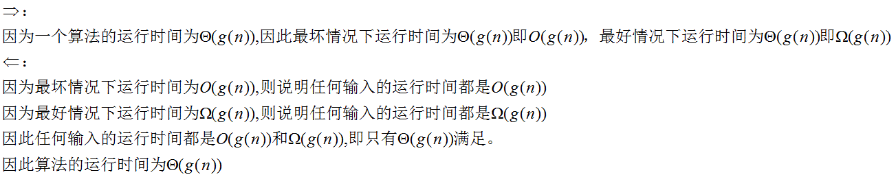

## 第三章 函数的增长

### 基本概念

## 练习

### 3.1-1假设f(n)和g(n)都是渐进非负函数。使用θ记号的基本定义来证明max(f(n),g(n))=θ(f(n)+g(n))

因为max(f(n),g(n))<=f(n)+g(n),所以存在c=1,n0=1,任意的n>=n0,max(f(n),g(n))<=c(f(n)+g(n)

又因为max(f(n),g(n))>=1/2(f(n)+g(n)),所以存在c=1/2,n0=1,任意的n>=n0,max(f(n),g(n))>=c(f(n)+g(n))

### 3.1-2 证明:对任意实常量a和b,其中b>0，有(n+a)b=θ(nb)

### 3.1-3 解释为什么"算法A的运行时间至少是O(n2)"这一表述是无意义的。

算法A的运行时间至少是b，则表示算法A运行时间>=b,因为b=O(n^2),并且f(n)=c=O(n^2),因此这句话表示**算法A的运行时间可以是任何值**。 

### 3.1-4 2n+1=O(2n)成立吗?22n = O(2n)成立吗?

2n+1 = O(2n)，22n != O(2n)

为了证明2n+1 = O(2n),必须找到常量c,n0>0让n>=n0情况都满足0<=2n+1<=c.2n

可以找到c=2和n0=1时对所有n都满足2n+1 = 2*2n

为了证明22n != O(2n),假设存在常量c,n0>0在所有n>=n0的情况下都满足0<=22n<=c·2n

则22n = 2n·2n<=c·2n 即2n<=c 但没有常量比2n大所以假设是不成立的。

### 证明定理3.1

### 证明:一个算法的运行时间为θ（g(n))当且仅当其最坏情况运行时间为O(g(n)),且其最好情况运行时间为Ω(g(n))

### 证明:o(g(n))∩ω(g(n))为空集

